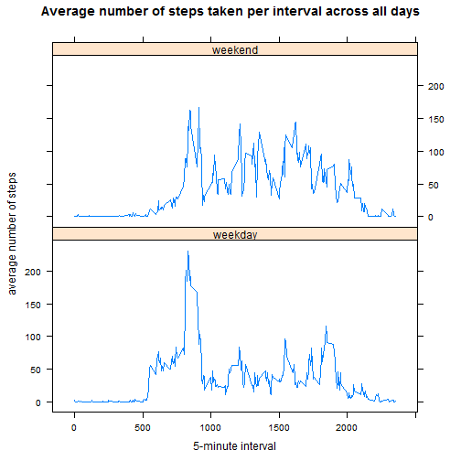

# Reproducible Research: Peer Assessment 1


## Loading and preprocessing the data


### 1. Load the data

Loading the data directly from the zip file.


```r
#load zipped data into variable data
data <- read.csv(unz("activity.zip", "activity.csv"), header=TRUE)
```

### 2. Process/transform the data (if necessary) into a format suitable for your analysis

Convert variable date from character to date format


```r
#convert variable date to appropiate format
data$date <- as.Date(data$date)
```

## What is mean total number of steps taken per day?


### 1. Histogram of the total number of steps taken each day


```r
aggdata <-aggregate(data$steps, by=list(data$date), 
                    FUN=sum, na.rm=TRUE)

names(aggdata) = c("date","TotalSteps")

hist(aggdata$TotalSteps, main="Histogram of the total number of steps taken each day",
     xlab="Total Steps", col = "blue")
```

 


### 2. Calculate and report the mean and median total number of steps taken per day


```r
mean_steps <- mean(aggdata$TotalSteps)
median_steps <- median(aggdata$TotalSteps)
```
The mean and median total number of steps taken per day are 9354.2295 and 
10395 respectively.


## What is the average daily activity pattern?


### 1. Time series plot of the 5-minute interval and the average number of steps taken, averaged across all days.


```r
aggbyinterval <-aggregate(data$steps, by=list(data$interval), 
                    FUN=mean, na.rm=TRUE)

names(aggbyinterval) = c("interval","AvgSteps")

plot(x=aggbyinterval$interval, y=aggbyinterval$AvgSteps, type="l", 
     main="Average number of steps taken per interval across all days", 
     xlab="5-minute interval", ylab="average number of steps", col = "blue")
```

 

```r
max_value <- max(aggbyinterval$AvgSteps)
max_interval <- aggbyinterval$interval[which.max(aggbyinterval$AvgSteps)]
```


### 2. Which 5-minute interval, on average across all the days in the dataset, contains the maximum number of steps?


The 835 interval contains the maximum number of steps (206.1698) on average across all the days in the dataset.


## Imputing missing values


### 1. Calculate and report the total number of missing values in the dataset


```r
#Get index of missing values
totmissing <- sum(is.na(data$steps))
```

There are 2304 missing values in the dataset.


### 2. Strategy for filling in all of the missing values in the dataset.

In order to fill in all of the missing values we will use the mean for that 5-minute interval across all the days in the dataset.


### 3. Create a new dataset with the missing data filled in.


```r
#Get index of missing values
missing <- is.na(data$steps)

#insert records with missing data first
data2 <- data[missing,]

#fill in missing values
for (m in aggbyinterval$interval){
    data2[data2$interval== m,]$steps <- 
        aggbyinterval[aggbyinterval$interval== m,]$AvgSteps
}

#add complete records to data2
data2 <- rbind(data2, data[!missing,])
```


### 4. Histogram of the total number of steps taken each day.


```r
aggdata2 <-aggregate(data2$steps, by=list(data2$date), 
                    FUN=sum, na.rm=TRUE)

names(aggdata2) = c("date","TotalSteps")

hist(aggdata2$TotalSteps, main="Histogram of the total number of steps taken each day",
     xlab="Total Steps", col = "red")
```

 


```r
mean_steps2 <- mean(aggdata2$TotalSteps)
median_steps2 <- median(aggdata2$TotalSteps)
```

The mean and median total number of steps taken per day are 1.0766 &times; 10<sup>4</sup> and 
1.0766 &times; 10<sup>4</sup> respectively. 


### Do these values differ from the estimates from the first part of the assignment? 


There is a difference of -1411.9592 between the mean of the original data and the imputed data.

There is a difference of -371.1887 between the median of the original data and the imputed data.


### What is the impact of imputing missing data on the estimates of the total daily number of steps?

Data appears more normalized as we can from the graph and by the fact that mean and median become equal. We removed outliers.


## Are there differences in activity patterns between weekdays and weekends?

### 1. Create a factor variable with two levels - "weekday" and "weekend"


```r
wkday <- weekdays(data2$date)

wkday [wkday %in% c('Saturday','Sunday')] <- "weekend"
wkday [!wkday == 'weekend'] <- "weekday"

data2 <- cbind(data2, weekday = as.factor(wkday) )
```

### 2. Time series plot of the 5-minute interval and the average number of steps taken, averaged across all weekday days or weekend days. 


```r
## Loading the lattice package
 
library("lattice")

aggbyinterval2 <-aggregate(data2$steps, by=list(data2$weekday, data2$interval), 
                    FUN=mean, na.rm=TRUE)

names(aggbyinterval2) = c("weekday","interval","AvgSteps")


xyplot(AvgSteps  ~ interval | factor(weekday), data=aggbyinterval2,
   type=c("l"),
   main="Average number of steps taken per interval across all days",
   xlab="5-minute interval",
   ylab="average number of steps",
   layout=(c(1,2))
)
```

 

```r
max_value_weekday <- max(aggbyinterval2[aggbyinterval2$weekday == "weekday",]$AvgSteps)
max_value_weekend <- max(aggbyinterval2[aggbyinterval2$weekday == "weekend",]$AvgSteps)

max_interval_weekday <- aggbyinterval2$interval[which.max(aggbyinterval2[aggbyinterval2$weekday == "weekday",]$AvgSteps)]
max_interval_weekend <-  aggbyinterval2$interval[which.max(aggbyinterval2[aggbyinterval2$weekday == "weekend",]$AvgSteps)]
```


We can see different patterns between weekdays and weekends.

On weekdays activities begins earlier and becomes maximum at interval 415. The first hours are the most active, decaying on the rest of the day.

On the other hand, on weekends, activities begin later and becomes maximum at interval 435, with less variation along the day.

The maximum average steps in weekends are 166.6392 and in weekdays 230.3782.


